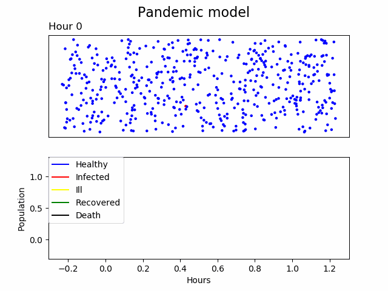
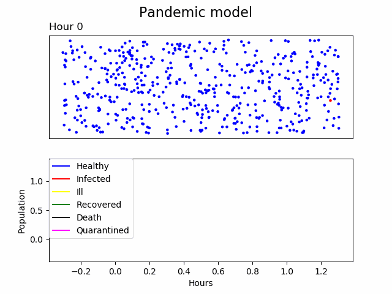

# Pandemic simulation

The goal of this program is to model a pandemic that:
- Takes place in a limited rectangular (**xlimit, ylimit**),
- In the defined area there is a population of **N** healthy people and one of them is infected,
- Simulate people movement with **dx** range in each timestamp,
- People need to be close enough **R_inf** and long enough **T_inf** for an infection to occur,
- The disease has two stages:
  - In the first stage **,,Infected”** for the incubation period **T_inc** a person can infect others and can move.
  - In the second stage **,,Ill”** for the convalescence time **T_rec** a person can infect others but cannot move.
- After the convalescence time, recovery or death of the person occurs. Morality rate is determined by the **DR** parameter.

## Usage
The following parameter values were assumed:
```python
xlimit = 10          # Rectangle dimension in km
ylimit = 10          # Rectangle dimension in km
N = 500              # Number of people
timestamp = 1        # In hours
number_of_hours = 60  # Duration of the pandemic
dx = 0.5             # Range of single movement in one ts
MR = 0.6             # % of people moving in one timestamp
R_inf = 0.5          # How close people must be to get infection in km
T_inf = 0.5          # How much time people must spend <= R_inf to get infection in h
T_inc = 7            # Incubation time in hours, person can infect people (no symptoms) - person moves
T_rec = 20           # Convalescence time, person can infect people (symptoms) - person stops
DR = 0.1             # Mortality rate. Recovery or death.
```

The results:
<p align="center">
  
</p>

## Quarantine mechanism
Using this mechanism, an infected person can be quarantined with a certain probability.
The result when the probablity of quarantine of an infected person was 5%:
<p align="center">
  
</p>

## Warning
This pandemic simulation cannot be used to predict events durnig a real pandemic (e.g. COVID-19).
Simulation of a real pandemic requires taking into account hundreds of parameters that are not included here.
Nevertheless, this simulation can be used to visualize how each parameter affects the development of a pandemic and how we can slow down the spread of the virus.

